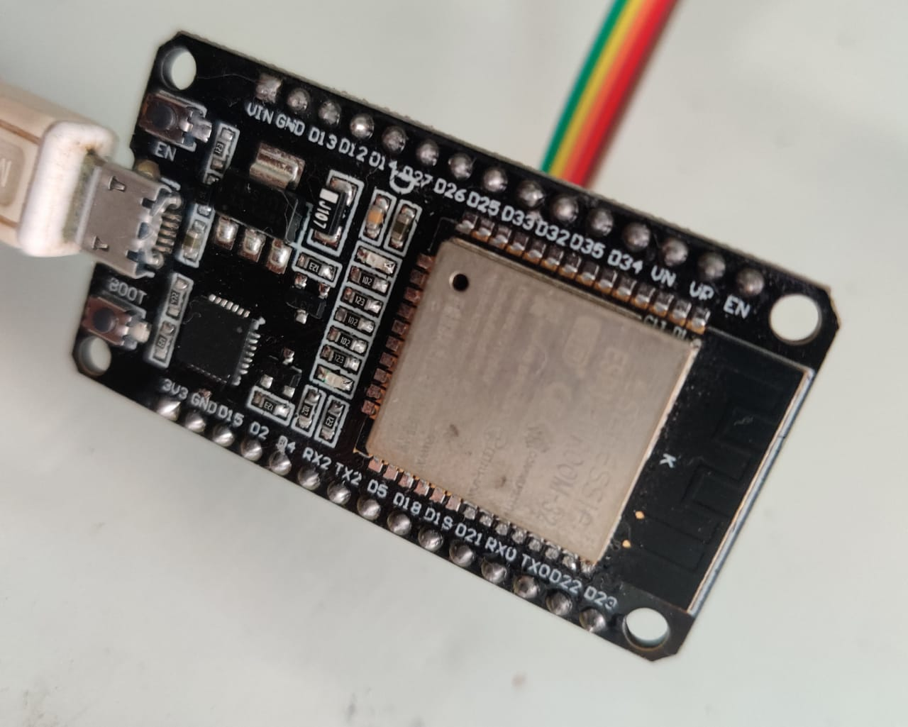
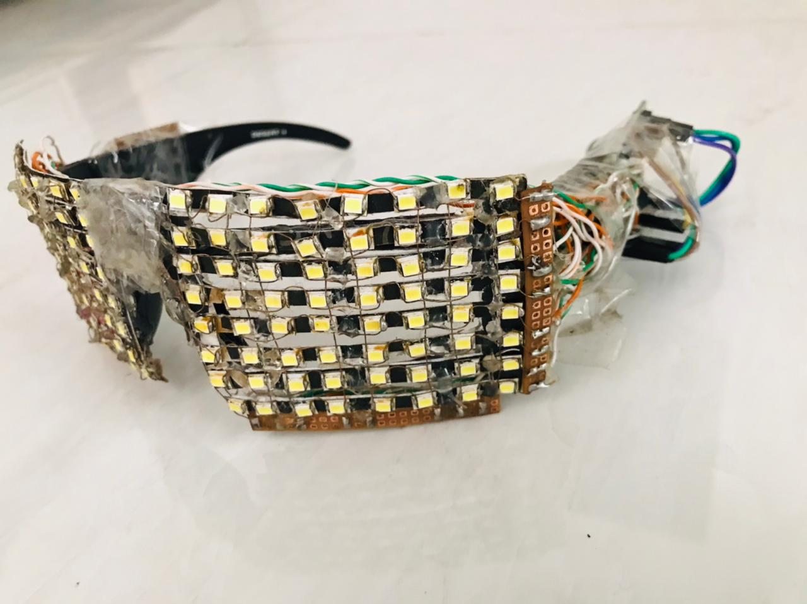

# SmartSunGlasses
A smart controlled sun glasses comprising of several electronic devices components, communication protocols and embedded with software application.
It comprises of a esp32 controller which works as a node for this project.

 

 
1) This product would offer a new way of communication which would be useful for the deaf and dumb as they are unable to talk and/or speak.

•	He/she can communicate with the other person easily via displaying the text on his glares and the viewer can easily understand what he/she is trying to communicate.
•	In this product, a person has to wear smart glasses comprising of Bluetooth/Wi-Fi module, LEDs, glasses, and other electronics components and devices.

 2)	Here, a deaf/dumb person can convey the message using his worn smart goggles. Actually, the message will be written by a deaf/dumb person in his mobile application and, through designed mobile application.

•	Furthermore, this product also offers a new way of expressing feelings and/or emotions.
•	The person can express his/her feelings or expressions with built-in emotes in the mobile application and through mobile application, it can be transferred to smart goggles using Bluetooth/Wi-Fi technology.
•	This product is optimised with a scrolling text/emote feature with adjustable speed.

# Application
1.	The deaf/mute people who cannot convey their messages to someone, now they can do it very quickly and easily using their smart phones.
2.	Also they can see through the glasses at the same time.
3.	A fashionable and helpful product will lead in divergence of lifestyle of deaf/dumb people.

# Prototype Model

 
